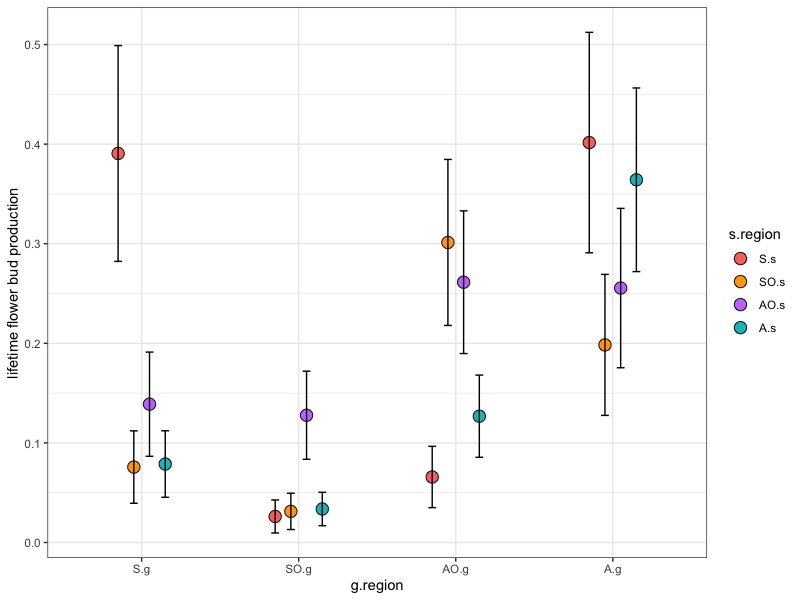

```{r dataprocess, include=FALSE, cache=TRUE, echo=FALSE}
knitr::opts_chunk$set(echo = TRUE)
```

```{r, code = readLines("./scripts/dataprep.R"), echo=FALSE, warning=FALSE, message=FALSE, cache=FALSE, include=FALSE}
```


# Main Results #

## Establishment ##

Establishment does not differ by mating system or source region, and only differs in one garden (AO2), where apos had higher establishment success. Comparing these two models with a likelihood ratio test shows that using garden as a fixed effect is a better fit...
```
est ~ ms*g.region + (1|garden/pop)
est ~ ms*garden + (1|pop) [*** better fit]
```
I've plotted the predicted means from each model (r package ggeffects) here.


Here's the same for s.region * g.region, which I think better reflects our experimental design...


## aster model

Here are the results from my aster model. It includes survival, flowering, and number of flowers as the fitness variables, 'mating system' x 'garden' interaction as fixed effects, and population as a random effect. Similar to the establishment GLMMs above, LRT showed that the model with garden as a fixed effect fits better than g.region as fixed with garden as random.  I've 'predicted' lifetime fitness estimates and standard errors for each mating system in each garden and plotted them here:


Judging by the above figure, it seems quite clear that for sexuals, range limit ≠ niche limit! There's also some indication of local adaptation / homesite advantage for the sexuals in the southern gardens. Other than that, there's no obvious patterns emerging in the other garden regions...For example, in the MT gardens, sexuals had much higher fitness than apo's in AA1, but much lower in AA2.

When looking at lifetime fitness predictions by g.region instead of garden, we find this:


Sexuals have higher lifetime fitness in their own region, but have lower fitness at their `range edge' and no difference (when averaged between the two gardens) beyond their range. 

In what I just realized is a better reflection of our experimental design, I re-made the aster model with s.region * g.region as fixed effects...Here's what it looks like:



## Buds per individual planted (BPP) ##

Number of buds per individual planted over the course of the experiment. For this I simply summed up the number of buds produced by each mating system in each garden, and divided by the number of individuals planted at the start of the experiment. This plot shows almost exactly the same pattern as the plot from the aster model above...

```{r, fig.height=6, fig.width=8, cache=FALSE, echo=FALSE, warning=FALSE, message=FALSE}
gg.bpp
```

## Bootstrapping ##

The similarity of the BPP plot and the aster model results lead to my bootstrapping adventure. The idea is to connect the establishment data with the garden data by multiplication, and sample with replacement to add confidence intervals to the estimates. The general workflow is to sample the establishment data 3000x, the garden data 3000x, calculate the mean establishment success and mean BPP per ms and garden in each replicate dataset, and multiply across all 3000x of those to get a range of  EBPP (mean establishment success x buds per individual planted) values. The confidence intervals were calculated from these sampled EBPP values, and plotted around the observed EBPP means here:


As you can see, all the confidence intervals overlap, indicating that (when taking into account establishment success) there are no differences in fitness between sexuals and apomicts in any of the gardens. The same is true when looking a garden region:


Here's the same for s.region * g.region


## Size models ##

I've modeled leaf size and leaf length in each year using similar model structure. 
e.g.
```
leaf.length ~ ms * g.region + (1|garden/pop)
leaf.length ~ ms * garden + (1|pop)
```
In all cases the second model (with garden as fixed effect) has the better fit. For both leaf length and leaf number, there some significant differences between mating systems (usually in only one garden). The general trend is that when there are differences, sexuals have longer leaves while apos have more leaves. Here's an example from each:


# Data Exploration of raw means #

I've made some summary plots for each of the fitness traits we've measured over the course of the experiment - one plot for each trait, showing gardens~years and summarizing the sexuals (red) and apomicts (blue).

<!-- ## Establishment -->

<!-- First we've got the data from the establishment plots in each garden. These are just the means + SE for each mating system in each garden. -->

<!-- ```{r, fig.height=9, fig.width=12, cache=FALSE, echo=FALSE} -->
<!-- gg.est.ms -->
<!-- ``` -->

<!-- And here's the means for each population in each garden -->

<!-- ```{r, fig.height=9, fig.width=12, cache=FALSE, echo=FALSE} -->
<!-- gg.est.pop -->
<!-- ``` -->

## Survival

```{r, fig.height=6, fig.width=8, cache=FALSE, echo=FALSE}
gg.surv.means.ms.all
```

## Size 

Leaf length

```{r, fig.height=6, fig.width=8, cache=FALSE, echo=FALSE, warning=FALSE, message=FALSE}
gg.length.means.ms.all
```

Leaf Number

```{r, fig.height=6, fig.width=8, cache=FALSE, echo=FALSE, warning=FALSE, message=FALSE}
gg.num.means.ms.all
```

## Flowering

Number of flowering individuals
```{r, fig.height=6, fig.width=8, cache=FALSE, echo=FALSE, warning=FALSE, message=FALSE}
gg.numflower.ms.all
```

Number of flower heads
```{r, fig.height=6, fig.width=8, cache=FALSE, echo=FALSE, warning=FALSE, message=FALSE}
gg.budsum.ms.all
```

Percent of surviving individuals that flowered.
```{r, fig.height=6, fig.width=8, cache=FALSE, echo=FALSE, warning=FALSE, message=FALSE}
gg.meanflower.ms.all
```

Now the same thing but looking by population in each garden

```{r, fig.height=6, fig.width=8, cache=FALSE, echo=FALSE, warning=FALSE, message=FALSE}
gg.bpp.pop
```

<!-- This is somewhat crude, but gives a good visual exploration of what we're hoping to look at. This takes (for each mating system) the mean establishment success in each garden * the number of buds per individual planted * the mean number of good seeds per bud (from source populations) -->

<!-- ```{r, fig.height=6, fig.width=8, cache=FALSE, echo=FALSE, warning=FALSE, message=FALSE} -->
<!-- gg.ebpps.ms -->
<!-- ``` -->

